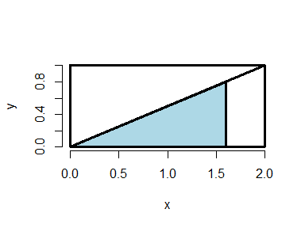
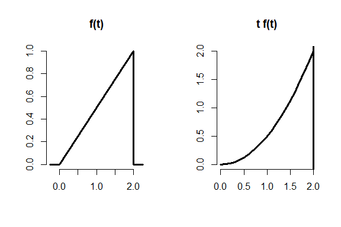

#### Probability Basics
Now consider the experiment of rolling 2 dice, one red and one green. Assume the dice are fair and not loaded. How many distinct outcomes are possible?

`36`

If an event E can occur in more than one way and these ways are disjoint (mutually exclusive) then P(E) is the sum of the probabilities of each of the ways in which it can occur.

Rolling these two dice, what's the probability of rolling a 10?

`3/36`

What sum is the most likely when rolling these two dice?

`7`

The probability of at least one of two events, A and B, occurring is the sum of their individual probabilities minus the probability of their intersection. P(A U B) = P(A) + P(B) - P(A&B).

Back to rolling two dice. Which expression represents the probability of rolling an even number or a number greater than 8?

The probability of rolling an even number is 1/2 or 18/36. There are 10 ways of rolling a number greater than '8' - 4 ways for rolling '9', 3 for '10', 2 for '11' and 1 for '12'. How big is the intersection between rolling an even number and those greater than '8'?

`(18+10-4)/36`


### Difinitions
#### PMF Probability Mass Function
gives the probability that a **discrete** random variable is exactly equal to some value.

For instance, suppose we have a coin which may or may not be fair. Let x=0 represent a 'heads' outcome and x=1 represent a 'tails' outcome of a coin toss. If p is the probability of 'heads' which of the following represents the PMF of the coin toss? The variable x is either 0 (heads) or 1 (tails).

`(p^(1-x))*(1-p)^x`

#### PDF probability density function
associated with a **continuous** random variable. To quote from Wikipedia, it "is a function that describes the relative likelihood for this random variable to take on a given value. The probability of the random variable falling within a particular range of values is given by ... the area under the density function but above the horizontal axis and between the lowest and greatest values of the range."

<!-- -->


Now consider the shaded portion of the triangle - a smaller triangle with a base of length 1.6 and height determined by the diagonal.We'll answer the question, "What proportion of the big triangle is shaded?"  

What is the area of the blue triangle?

`> .8*1.6/2`  
`[1] 0.64`

So, what is the probability that the kibble we throw at the bigger triangle will hit the blue portion?  
`> .64`

#### CDF The cumulative distribution function
The cumulative distribution function (CDF) of a random variable X, either discrete or continuous, is the function F(x) equal to the probability that X is less than or equal to x. In the example above, the area of the blue triangle represents the probability that the random variable was less than or equal to the value 1.6.

 In the triangle example from above, which of the following expressions represents F(x), the CDF?

`x*x/4`

When the random variable is continuous, as in the example, the PDF is the **derivative** of the CDF. So integrating the PDF (the line represented by the diagonal) yields the CDF. When you evaluate the CDF at the limits of integration the result is an area.

To see this in the example, we've defined the function mypdf for you. This is the equation of the line represented by the diagonal of the rectangle. As the PDF, it is the derivative of F(x), the CDF.


```r
mypdf <- function(x){x/2}
#Now use the R function integrate to integrate mypdf 
#with the parameters lower equal to 0and upper equal to 1.6.
#See if you get the same area (probability) you got before.

integrate(mypdf,lower = 0,upper = 1.6)
```

```
## 0.64 with absolute error < 7.1e-15
```

#### survivor function S(x)
The survivor function S(x) of a random variable X is defined as the function of x equal to the probability that the random variable X is greater than the value x. This is the complement of the CDF F(x), in our example, the portion of the lower triangle that is not shaded.


#### The quantile v of a CDF
is the point x_v at which the CDF has the value v. More precisely, F(x_v)=v. A percentile is a quantile in which v is expressed as a percentage.

What is the 50th percentile of the CDF F(x)=(x^2)/4 from the example above?

`> sqrt(.5*4)  
[1] 1.414214`


### Conditional Probability

- obtained from this formula:  
P(A|B) = P(A & B)/ P(B)

- so, **P(A&B)** = P(A|B) * P(B), right?  
**simple form of Bayes' Rule**:  
P(B|A) =   P(B&A)/P(A) = P(A|B) * P(B)/**P(A)**  
*We use ~B to represent 'not B' or 'B complement'*  
We can then express **P(A)** = P(A|B) * P(B) + P(A|~B) * P(~B)  
and substitute this is into the denominator of Bayes' Formula:  
 **P(B|A)** = P(A|B) * P(B) / ( P(A|B) * P(B) + P(A|~B) * P(~B) )


#### We'll now discuss the example of the HIV test: 

- Suppose we know the accuracy rates of the test for both the positive case (positive result when the patient has HIV) and negative (negative test result when the patient doesn't have HIV). These are referred to as test sensitivity and specificity, respectively.

- **By Bayes' Formula**: P(D|+) = P(+|D) * P(D) / ( P(+|D) * P(D) + P(+|~D) * P(~D) )  
the prevalence of HIV in the patient's population as the value for P(D).  
Note that since P(~D)=1-P(D) and P(+|~D) = 1-P(-|~D) we can calculate P(D|+).


- Also formulating for P(~D|+), we get the same denominator.  

- This means that if we formed a ratio of P(D|+) to P(~D|+) we'd get a much simpler expression:  
**P(D|+) / P(~D|+)** = P(+|D) * P(D) / (P(+|~D) * P(~D)) = P(+|D)/P(+|~D) * P(D)/P(~D)  
The equation says that the **post-test odds** of disease equals the **pre-test odds of disease** (that is, P(D)/P(~D) ) times the DLR_+ **(diagnostic likelihood ratio)**.

- In other words, a **DLR_+** value equal to N indicates that the hypothesis of disease is N times more supported by the data than the hypothesis of no disease.

- Taking the formula above and replacing the '+' signs with '-' yields a formula with the DLR_- :  
**P(D|-) / P(~D|-)** = P(-|D) / P(-|~D) * P(D)/P(~D)  
which says what about the post-test odds of disease relative to the pre-test odds of disease given negative test results?  
`post-test odds are less than pre-test odds`


-  We'll conclude with iid. Random variables are said to be **iid** if they are independent and identically distributed. By independent we mean "statistically unrelated from one another". Identically distributed means that "all have been drawn from the same population distribution"


### Expected Values

E(X), is a measure of its central tendency.  

- For a *discrete* random variable X with PMF p(x), E(X) is defined as a **sum**, over all possible values x, of the quantity `x*p(x)`.  
E(X) represents the center of mass of a collection of locations and weights, {x, p(x)}

- For a *continuous* random variable X, the expected value is defined analogously as it was for the discrete case. Instead of summing over discrete values, however, the expectation **integrates** over a continuous function.  
 It follows that for continuous random variables, E(X) is the **area** under the function `t*f(t)` , where f(t) is the PDF (probability density function) of X.

<!-- -->

- Plot shows the triangular PDF f(t) on the left and the parabolic t*f(t) on the right. The area under the parabola between 0 and 2 represents the expected value of the random variable with this PDF.  
- To find the expected value of this random variable you need to integrate the function `t*f(t)` . The function you're integrating over is therefore t^2/2.


```r
myfunc <- function(x){x^2/2}
#get Expected Value:
integrate(myfunc,0,2)
```

```
## 1.333333 with absolute error < 1.5e-14
```

- However, often populations are too big to measure, so we have to sample them and then we have to use sample means. That's okay because sample expected values estimate the population versions.  
The expected value or mean of the sample mean is the population mean.  

- We can show that the expected value of a sample mean equals the population mean with some simple algebra: 


- Let X_1, X_2, ... X_n be a collection of n samples from a population with mean mu. The mean of these is (X_1 + X_2 + ... + X_n)/n.  
Recall that E(aX)=aE(X), so E( (X_1+..+X_n)/n ) = 1/n * (E(X_1) + E(X_2) + ... + E(X_n)) = (1/n)*n*mu = mu.


