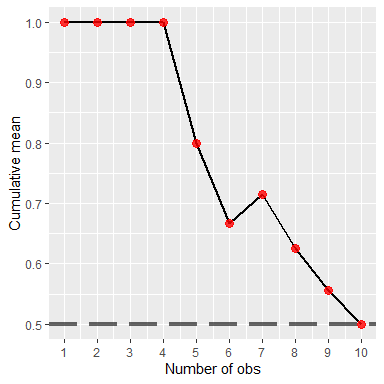
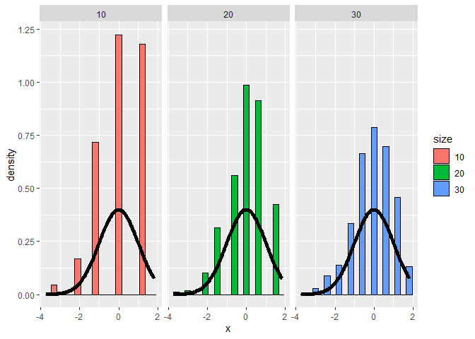
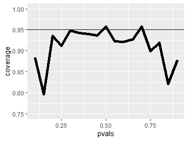
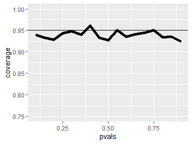
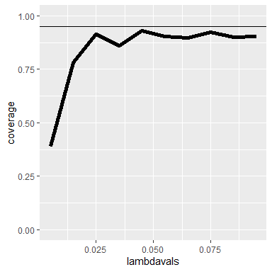
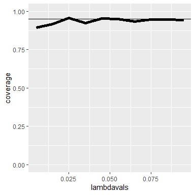

## Variance

- The variance of a random variable, as a measure of spread or dispersion, is, like a mean, defined as an expected value. It is the expected squared distance of the variable from its mean.  
Var(X) = E( (X-mu)^2 ) = E( (X-E(X))^2 ) = E(X^2)-E(X)^2

- the **sample variance** is an unbiased estimator of **population variance**.  

- if the population is infinite, the **variance of the sample mean is the population variance divided by the sample size**.  
Specifically, **Var(X') = sigma^2 / n**.  
where X' represents a sample mean, sigma represents population SD and n is the sample size.

- Var(X') =Var(1/n* Sum(X_i))=(1/n^2 )* Var(Sum(X_i))=(1/n^2 )*Sum(sigma^2 )=sigma^2 /n for infinite populations when our samples are independent.

- The standard deviation of a statistic is called its standard error, so the standard error of the sample mean is the square root of its variance.

## Common Distributions

### Bernoulli Distribution

- associated with experiments which have only 2 possible outcomes. These are also called (by people in the know) binary trials, such as Flipping a coin.

- Suppose we also specify that the probability that the Bernoulli outcome of 1 is p. The probability of a 0 outcome is then 1-p. and  PMF of a Bernoulli distribution is  
p^x * (1-p)^(1-x)

-  Suppose we have a Bernoulli random variable and, as before, the probability it equals 1 (a success) is p and probability it equals 0 (a failure) is 1-p.  
What is its mean? `p`  
what represents E(X^2)? `p`  
find variance:  
Var = E(X^2)-(E(X))^2 = p-p^2 =p*(1-p)  

### Binomial Distribution

- Binomial random variables are obtained as the sum of iid Bernoulli trials.  
Binomial random variables represent the number of successes, k, out of n independent Bernoulli trials. Each of the trials has probability p.  

- PMF of a binomial random variable X represent the probability that X=x. In other words, that there are x successes out of n independent trials.  
Here x, the number of successes, goes from 0 to n, the number of trials, and choose(n,x) represents the binomial coefficient 'n choose x' which is the number of ways x successes out of n trials can occur regardless of order.  
`choose(n,x) * p^x * (1-p)^(n-x)`

- Suppose we were going to flip a biased coin 5 times. The probability of tossing a head is .8 and a tail .2. What is the probability that you'll toss at least 3 heads.  


```r
#using equation choose(n,x) * p^x * (1-p)^(n-x)
choose(5,3) * .8^3 * (1-.8)^(5-3)+choose(5,4) * .8^4 * (1-.8)^(5-4)+choose(5,5) * .8^5 * (1-.8)^(5-5)
```

```
## [1] 0.94208
```

```r
# using R Pbinom function
pbinom(q = 2,size = 5,prob = .8,lower.tail = F)
```

```
## [1] 0.94208
```

### Normal or Gaussian distribution

- It has a complicated density function involving its mean mu and variance sigma^2. The key fact of the density formula is that when plotted, it forms a bell shaped curve, symmetric about its mean mu. The variance sigma^2 corresponds to the width of the bell, the higher the variance, the fatter the bell. We denote a normally distributed random variable X as X ~ N(mu, sigma^2).

- When mu = 0 and sigma = 1 the resulting distribution is called the standard normal distribution and it is often labeled Z.

- Approximately 68%, 95% and 99% of the normal density lie within 1, 2 and 3 standard deviations from the mean, respectively. These are shown in the three shaded areas of the figure. For example, the darkest portion (between -1 and 1) represents 68% of the area.


<!-- -->

- The R function qnorm(prob) returns the value of x (quantile) for which the area under the standard normal distribution to the left of x equals the parameter prob.  
Use qnorm now to find the 10th percentile of the standard normal.  

```r
qnorm(.1)
```

```
## [1] -1.281552
```

- We can use the symmetry of the bell curve to determine other quantiles. Given that 2.5% of the area under the curve falls to the left of x=-1.96, what is the 97.5 percentile for the standard normal?  
`1.96`

- Here are two useful facts concerning normal distributions. If X is a normal random variable with mean mu and variance sigma^2, i.e., X ~ N(mu,sigma^2),  
then the random variable Z defined as Z = (X -mu)/sigma is normally distributed with mean 0 and variance 1, i.e., Z ~ N(0, 1). (Z is standard normal.)

- The converse is also true. If Z is standard normal, i.e., Z ~ N(0,1), then the random variable X defined as X = mu + sigma*Z is normally distributed with mean mu and variance sigma^2, i.e., X ~ N(mu, sigma^2)

- We'll show how to find the 97.5th percentile of a normal distribution with mean 3 and variance 4.

```r
qnorm(.975,3,2)
```

```
## [1] 6.919928
```

```r
#or calc from standard normal then convert by sigma and mean
qnorm(.975)*2+3
```

```
## [1] 6.919928
```

- Suppose you have a normal distribution with mean 1020 and standard deviation of 50 and you want to compute the probability that the associated random variable X > 1200.


```r
pnorm(1200,1020,50,lower.tail = FALSE)
```

```
## [1] 0.0001591086
```

```r
#or we can use the standard normal quantile instead
pnorm((1200-1020)/50,lower.tail = FALSE)
```

```
## [1] 0.0001591086
```

### Poisson Distribution

-  as Wikipedia tells us, "a discrete probability distribution that expresses the probability of a given number of events occurring in a fixed interval of time and/or space if these events occur with a known average rate and independently of the time since the last event."

- In other words, the Poisson distribution models counts or number of event in some interval of time. From Wikipedia, "Any variable that is Poisson distributed only takes on integer values."

- The PMF of the Poisson distribution has one parameter, lambda. As with the other distributions the PMF calculates the probability that the Poisson distributed random variable X takes the value x.  
Specifically, P(X=x)=(lambda^x)e^(-lambda)/x!. Here x ranges from 0 to infinity.

- The mean and variance of the Poisson distribution are both lambda.

- Poisson random variables are used to model rates such as the rate of hard drive failures. We write X~Poisson(lambda*t) where lambda is the expected count per unit of time and t is the total monitoring time.

- For example, suppose the number of people that show up at a bus stop is Poisson with a mean of 2.5 per hour, and we want to know the probability that at most 3 people show up in a 4 hour period. 


```r
ppois(3,2.5*4)
```

```
## [1] 0.01033605
```

- The Poisson distribution approximates the binomial distribution in certain cases.  
Recall that the binomial distribution is the discrete distribution of the number of successes, k, out of n independent binary trials, each with probability p.  
If n is large and p is small then the Poisson distribution with lambda equal to n*p is a good approximation to the binomial distribution.

- Estimate the probability that you'll see at most 5 successes out of 1000 trials each of which has probability .01


```r
#using binomial func:
pbinom(5,1000,.01)
```

```
## [1] 0.06613951
```

```r
#using pois func:
ppois(5,.01*1000)
```

```
## [1] 0.06708596
```


## Asymptotics

- Asymptotics is the topic which describes how statistics behave as sample sizes get very large and approach infinity. Pretending sample sizes and populations are infinite is useful for making statistical inferences and approximations since it often leads to a nice understanding of procedures.  

- Asymptotics generally give no assurances about finite sample performance, but they form the basis for frequency interpretation of probabilities (the long run proportion of times an event occurs).

### LLN 

-  The Law of Large Numbers (**LLN**) says that the average (mean) approaches what it's estimating. That the larger the sample size the better the estimation.  
As we flip a fair coin over and over, it eventually converges to the true probability of a head (.5).  
The LLN forms the basis of frequency style thinking.

-  To see this in action, we've created the function coinPlot. It takes an integer n which is the number of coin tosses that will be simulated. As coinPlot does these coin flips it computes the cumulative sum (assuming heads are 1 and tails 0), but after each toss it divides the cumulative sum by the number of flips performed so far.  
It then plots this value for each of the k=1...n tosses.


```r
library(ggplot2)
# Put initialization code in this file.
coinPlot <- function(n){
  means <- cumsum(sample(0 : 1, n , replace = TRUE)) / (1  : n)
  g <- ggplot(data.frame(x = 1 : n, y = means), aes(x = x, y = y)) 
  g <- g + geom_hline(size=1.5 ,yintercept = 0.5,alpha=0.6,
	linetype="longdash") + geom_line(size = 1)
if(n<100){
 	g <- g + geom_point(colour="red",size=3,alpha=0.8)
	}	 
  g <- g + labs(x = "Number of obs", y = "Cumulative mean")
  g <- g + scale_x_continuous(breaks=seq(0,n+1,ceiling(n/10)))
  print(g)
  invisible()
}
```


```r
#Try for n=10.
coinPlot(10)
```

<!-- -->


```r
#Try for n=10000.
coinPlot(10000)
```

<!-- -->

- Asymptotics in Action! The line approaches its asymptote of .5. This is the probability you expect since what we're plotting, the cumulative sum/number of flips, represents the probability of the coin landing on heads. As we know, this is .5 .

- We say that an estimator is **CONSISTENT** if it converges to what it's trying to estimate. The LLN says that the sample mean of iid samples is consistent for the population mean.

### CLT

- The CENTRAL LIMIT THEOREM (**CLT**) - one of the most important theorems in all of statistics. It states that the distribution of averages of iid variables (properly normalized) becomes that of a standard normal as the sample size increases.

- First, 'properly normalized' means that you transformed the sample mean X'. You subtracted the population mean mu from it and divided the difference by sigma/sqrt(n). Here sigma is the standard deviation of the population and n is the sample size.

- Second, the CLT says that for large n, this normalized variable, (X'-mu)/(sigma/sqrt(n)) is almost normally distributed with mean 0 and variance 1. Remember that n must be large for the CLT to apply.

- Suppose X_1, X_2, ... X_n are independent, identically distributed random variables from an infinite population with mean mu and variance sigma^2. Then if n is large, the mean of the X's, call it X', is approximately normal with mean mu and variance sigma^2/n. We denote this as X'~N(mu,sigma^2/n).

- Here's a figure showing the results of 3 such trials where each trial is for a different value of n (10, 20, and 30) using a biassed coin.  
We set the probability of a head to .9, so E(X)=.9 and the standard error is sqrt(.09/n).  
The larger the sample size the more closely the distribution looks normal, although with this biassed coin the normal approximation isn't as good as it was with the fair coin.


```r
nosim <- 1000
cfunc <- function(x, n) sqrt(n) * (mean(x) - 0.9) / sqrt(.1 * .9)
dat <- data.frame(
  x = c(apply(matrix(sample(0:1, prob = c(.1,.9), nosim * 10, replace = TRUE), 
                     nosim), 1, cfunc, 10),
        apply(matrix(sample(0:1, prob = c(.1,.9), nosim * 20, replace = TRUE), 
                     nosim), 1, cfunc, 20),
        apply(matrix(sample(0:1, prob = c(.1,.9), nosim * 30, replace = TRUE), 
                     nosim), 1, cfunc, 30)
  ),
  size = factor(rep(c(10, 20, 30), rep(nosim, 3))))
g <- ggplot(dat, aes(x = x, fill = size)) + geom_histogram(binwidth=.3, colour = "black", aes(y = ..density..)) 
g <- g + stat_function(fun = dnorm, size = 2)
g <- g + facet_grid(. ~ size)
print(g)
```

<!-- -->

### confidence intervals

-  We know from the CLT that for large n, the sample mean is normal with mean mu and standard deviation sigma/sqrt(n). We also know that 95% of the area under a normal curve is within two standard deviations of the mean.

- By symmetry of the curve, only  2.5% of the data is greater than the mean + 2 standard deviations (mu+2* sigma/sqrt(n)) and only 2.5% is less than the mean - 2 standard deviations (mu-2*sigma/sqrt(n)).  
So the probability that the sample mean **X'** is bigger than mu + 2sigma/sqrt(n) OR smaller than mu-2sigma/sqrt(n) is 5%.  Equivalently, the probability of being between these limits is 95%.

- The quantity X' plus or minus 2 sigma/sqrt(n) is called a **95% interval** for mu. The 95% say that if one were to repeatedly get samples of size n, about 95% of the interval obtained would contain mu, the quantity we're trying to estimate.

- As we've seen before, **in a binomial distribution** in which p represents the probability or proportion of success, the variance sigma^2 is p(1-p), so the standard error of the sample mean p' is sqrt(p(1-p)/n) where n is the sample size. The 95% confidence interval of p is then p' +/- 2*sqrt(p(1-p)/n).  
the 2 in this formula represents the approximate 97.5% normal quantile

- A critical point here is that we don't know the true value of p; that's what we're trying to estimate. How can we compute a confidence interval if we don't know p(1-p)? *We could be conservative and try to maximize it so we get the largest possible confidence interval*.
Calculus tells us that p(1-p) is maximized when p=1/2, so we get the biggest 95% confidence interval when we set p=1/2 in the formula p'+/- 2*sqrt(p(1-p)/n).  
which yields what expression for the 95% confidence interval for p?
`p'+/- 1/sqrt(n)`

-  Here's an example of applying this formula. Suppose you were running for office and your pollster polled 100 people. Of these 60 claimed they were going to vote for you. You'd like to estimate the true proportion of people who will vote for you and you want to be 95% confident of your estimate. We need to find the limits that will contain the true proportion of your supporters with 95% confidence, so we'll use the formula p' +/- 1/sqrt(n) to answer this question.  
First, what value would you use for p', the sampled estimate? `0.6`  
What would you use for 1/sqrt(n)? `1/10`  
The bounds of the interval then are `.5 and .7`  
How do you feel about the election? `confident!` 

- Another technique for calculating confidence intervals for binomial distributions is to replace p with p'. This is called the **Wald confidence interval**. We can also use the R function qnorm to get a more precise quantile value (closer to 1.96) instead of our ballpark estimate of 2.


```r
.6+c(-1,1)*qnorm(.975)*sqrt(.6*(1-.6)/100)
```

```
## [1] 0.5039818 0.6960182
```


- As an alternative to this Wald interval, we can also use the R function **binom.test** with the parameters 60 and 100 and let all the others default. This function "performs an exact test of a simple null hypothesis about the probability of success in a Bernoulli experiment." (This means it guarantees the coverages, uses a lot of computation and doesn't rely on the CLT.) 


```r
binom.test(60,100)$conf.int
```

```
## [1] 0.4972092 0.6967052
## attr(,"conf.level")
## [1] 0.95
```

- Now we're going to see that the **Wald** interval isn't very accurate **when n is small**.

- Suppose we flip a coin a small number of times, say 20. Also suppose we have a function mywald which takes a probability p, and generates 30 sets of 20 coin flips using that probability p.  
It uses the sampled proportion of success, p', for those 20 coin flips to compute the upper and lower bounds of the 95% Wald interval, that is, it computes the two numbers p'+/- qnorm(.975) * sqrt(p' * (1-p') / n) for each of the 30 trials. For the given true probability p, we count the number of times out of those 30 trials that the true probability p was in the Wald confidence interval. We'll call this the coverage.


```r
n <- 20
nosim <- 30
mywald <- function(p){phats <- rbinom(nosim, prob = p, size = n) / n
  ll <- phats - qnorm(.975) * sqrt(phats * (1 - phats) / n)
  ul <- phats + qnorm(.975) * sqrt(phats * (1 - phats) / n)
  print("Here are the p\' values")
  print(phats)
  print("Here are the lower")
  print(ll)
  print("Here are the upper")
  print(ul)
  mean(ll < p & ul > p)}
```

- try running mywald now with the probability .2.


```r
mywald(0.2)
```

```
## [1] "Here are the p' values"
##  [1] 0.20 0.25 0.15 0.20 0.20 0.40 0.20 0.20 0.20 0.15 0.40 0.20 0.10 0.25 0.40
## [16] 0.30 0.10 0.25 0.20 0.20 0.15 0.25 0.20 0.15 0.15 0.10 0.15 0.05 0.10 0.15
## [1] "Here are the lower"
##  [1]  0.024695492  0.060227303 -0.006490575  0.024695492  0.024695492
##  [6]  0.185296703  0.024695492  0.024695492  0.024695492 -0.006490575
## [11]  0.185296703  0.024695492 -0.031478381  0.060227303  0.185296703
## [16]  0.099163455 -0.031478381  0.060227303  0.024695492  0.024695492
## [21] -0.006490575  0.060227303  0.024695492 -0.006490575 -0.006490575
## [26] -0.031478381 -0.006490575 -0.045516829 -0.031478381 -0.006490575
## [1] "Here are the upper"
##  [1] 0.3753045 0.4397727 0.3064906 0.3753045 0.3753045 0.6147033 0.3753045
##  [8] 0.3753045 0.3753045 0.3064906 0.6147033 0.3753045 0.2314784 0.4397727
## [15] 0.6147033 0.5008365 0.2314784 0.4397727 0.3753045 0.3753045 0.3064906
## [22] 0.4397727 0.3753045 0.3064906 0.3064906 0.2314784 0.3064906 0.1455168
## [29] 0.2314784 0.3064906
```

```
## [1] 0.9666667
```

- Now, suppose instead of 30 trials, we used 1000 trials. Also suppose we did this experiment for a series of probabilities, say from .1 to .9 taking steps of size .05. More specifically, we'll call our function using 17 different probabilities, namely .1, .15, .2, .25, ... .9 . We can then plot the percentages of coverage for each of the probabilities.

- Here's the plot of our results. Each of the 17 vertices show the percentage of coverage for a particular true probability p passed to the function. Results will vary, but usually the only probability that hits close to or above the 95% line is the p=.5 . So this shows that when n, the number of flips, is small (20) the CLT doesn't hold for many values of p, so the Wald interval doesn't work very well.

<!-- -->


- Let's try the same experiment and increase n, the number of coin flips in each of our 1000 trials, from 20 to 100 to see if the plot improves. Again, results may vary, but all the probabilities are much closer to the 95% line, so the CLT works better with a bigger value of n.

<!-- -->

- A quick fix to the problem of having a small n is to use the **Agresti/Coull** interval. This simply means we add 2 successes and 2 failures to the counts when calculating the proportion p'. Specifically, if X is the number of successes out of the 20 coin flips, then instead of setting p'=X/20, let p'=(X+2)/24. We use 24 as the number of trials since we've added 2 successes and 2 failures to the counts. Note that we still use 20 in the calculation of the upper and lower bounds.

- Here's a plot using this Agresti/Coull interval, with 1000 trials of 20 coin flips each. It looks much better than both the original Wald with 20 coin flips and the improved Wald with 100 coin flips. However, this technique might make the confidence interval too wide.


```r
n <- 20; pvals <- seq(.1, .9, by = .05); nosim <- 1000
coverage <- sapply(pvals, function(p){
  phats <- (rbinom(nosim, prob = p, size = n) + 2) / (n + 4)
  ll <- phats - qnorm(.975) * sqrt(phats * (1 - phats) / n)
  ul <- phats + qnorm(.975) * sqrt(phats * (1 - phats) / n)
  mean(ll < p & ul > p)
})
g <- ggplot(data.frame(pvals, coverage), aes(x = pvals, y = coverage)) + geom_line(size = 2) + geom_hline(yintercept = 0.95) + ylim(.75, 1.0)
print(g)
```

<!-- -->

- Let's move on to **Poisson distributions** and confidence intervals. Recall that Poisson distributions apply to counts or rates. For the latter, we write X~Poisson(lambda*t) where lambda is the expected count per unit of time and t is the total monitoring time.

- Suppose a nuclear pump failed 5 times out of 94.32 days and we want a 95% confidence interval for the failure rate per day. The number of failures X is Poisson distributed with parameter (lambda*t). We don't observe the failure rate, but we estimate it as x/t. Call our estimate lambda_hat, so lambda_hat=x/t. According to theory, the variance of our estimated failure rate is lambda/t (Me as I guess: recall that variance of Poisson dist. is lambda and we divide by t instead of n at binomials as CLT).  
Again, we don't observe lambda, so we use our estimate of it instead. We thus approximate the variance of lambda_hat as lambda_hat/t.  

  -In this example what would you use as the estimated mean x/t?  
  `5/94.32 `
  
  -calculate a 95% confidence interval  
  
  ```r
  lamb <- 5/94.32
  lamb+c(-1,1)*qnorm(.975)*sqrt(lamb/94.32)
  ```
  
  ```
  ## [1] 0.006545667 0.099476386
  ```
  
  - As a check we can use R's function poisson.test with the arguments 5 and 94.32 to check this result. This is an exact test so it guarantees coverage.  
  
  ```r
  poisson.test(5,94.32)$conf
  ```
  
  ```
  ## [1] 0.01721254 0.12371005
  ## attr(,"conf.level")
  ## [1] 0.95
  ```
  
- Now to check the coverage of our estimate we'll run the same simulation experiment we ran before with binomial distributions. We'll vary our lambda values from .005 to .1 with steps of .01 (so we have 10 of them), and for each one we'll generate 1000 Poisson samples with mean lambda*t. We'll calculate sample means and use them to compute 95% confidence intervals. We'll then count how often out of the 1000 simulations the true mean (our lambda) was contained in the computed interval.  


<!-- -->

- We see that the coverage improves as lambda gets larger, and it's quite off for small lambda values.  
Now it's interesting to see how the coverage improves when we increase the unit of time. In the previous plot we used t=100 (rounding the 94.32 up). Here's a plot of the same experiment setting t=1000.

<!-- -->

- We see that the coverage is much better for almost all the values of lambda, except for the smallest ones.
