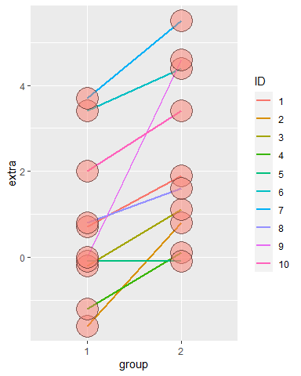

## T Confidence Intervals

- In the Asymptotics lesson we mentioned the Z statistic Z=(X'-mu)/(sigma/sqrt(n)) which follows a standard normal distribution.

- Now we'll define the **t statistic** which looks a lot like the Z. It's defined as t=(X'-mu)/(s/sqrt(n)). Like the Z statistic, the t is centered around 0. The only difference between the two is that the population std deviation, sigma, in Z is *replaced by the sample standard deviation in the t*. So the distribution of the t statistic is independent of the population mean and variance. Instead it depends on the sample size n.

- As a result, for t distributions, the formula for computing a confidence interval is similar to what we did in the last lesson. However, instead of a **quantile** for a normal distribution we use a quantile for a **t distribution**. So the formula is Est +/- t-quantile *std error(Est). The other distinction, which we mentioned before, is that we'll use the sample standard deviation when we estimate the standard error of Est.

- These t confidence intervals are very **handy**, and if you have a choice between these and normal, pick these. We'll see that as datasets get larger, t-intervals look normal.

- The t distribution, invented by William Gosset in 1908, has **thicker tails** than the normal. Also, instead of having two parameters, mean and variance, as the normal does, the t distribution has **only one** - the number of degrees of freedom (df).

- As **df increases**, the t distribution gets more like a standard **normal**, so it's centered around 0. Also, the t *assumes that the underlying data are iid Gaussian so the statistic (X' - mu)/(s/sqrt(n)) has n-1 degrees of freedom*.

-  To see what we mean, the function **myplot**, which takes the integer df as its input and plots the t distribution with df degrees of freedom. It also plots a standard normal distribution so you can see how they relate to one another.


```r
library(ggplot2)
k <- 1000
xvals <- seq(-5, 5, length = k)
myplot <- function(df){
  d <- data.frame(y = c(dnorm(xvals), dt(xvals, df)),
                  x = xvals,
                  dist = factor(rep(c("Normal", "T"), c(k,k))))
  g <- ggplot(d, aes(x = x, y = y)) 
  g <- g + geom_line(size = 2, aes(colour = dist))
  print(g)
}
```


```r
myplot(2)
```

<!-- -->

- You can see that the hump of t distribution (in blue) is not as high as the normal's. Consequently, the two tails of the t distribution absorb the extra mass, so they're **thicker** than the normal's. Note that with 2 degrees of freedom, you only have 3 data points. Ha! Talk about small sample sizes. Now try myplot with an input of 20.


```r
myplot(20)
```

<!-- -->

- The two distributions are almost right on top of each other using this higher degree of freedom.

- Another way to look at these distributions is to **plot their quantiles**. We've provided a second function, myplot2, which does this. It plots a lightblue reference line representing normal quantiles and a black line for the t quantiles. Both plot the quantiles starting at the 50th percentile which is 0 (since the distributions are symmetric about 0) and go to the 99th.


```r
pvals <- seq(.5, .99, by = .01)
myplot2 <- function(df){
  d <- data.frame(n= qnorm(pvals),t=qt(pvals, df),
                  p = pvals)
  g <- ggplot(d, aes(x= n, y = t))
  g <- g + geom_abline(size = 2, col = "lightblue")
  g <- g + geom_line(size = 2, col = "black")
  g <- g + geom_vline(xintercept = qnorm(0.975))
  g <- g + geom_hline(yintercept = qt(0.975, df))
  print(g)
}
```


```r
myplot2(2)
```

<!-- -->

- The distance between the two thick lines represents the difference in sizes between the quantiles and hence the two sets of intervals.

- Note the thin horizontal and vertical lines. These represent the .975 quantiles for the t and normal distributions respectively.  
Check the placement of the horizontal:


```r
qt(.975,2)
```

```
## [1] 4.302653
```

- Now run myplot2 with an argument of 20.


```r
myplot2(20)
```

<!-- -->

- The quantiles are much **closer** together with the **higher degrees of freedom**. At the 97.5 percentile, though, the t quantile is still greater than the normal. Student's Rules!

- This means the the t interval is always **wider** than the normal. This is because estimating the standard deviation introduces more uncertainty so a wider interval results.

- So the **t-interval** is defined as X' +/- t_(n-1)*s/sqrt(n) where t_(n-1) is the relevant quantile.  
The t interval assumes that the data are iid normal, though it is robust to this assumption and works well whenever the distribution of the data is roughly symmetric and mound shaped.

### paired observations

- Although it's pretty great, the t interval isn't always applicable. For **skewed** distributions, the spirit of the t interval assumptions (being centered around 0) are violated. There are ways of working around this problem (such as taking logs or using a different summary like the median).  
For highly discrete data, like binary, intervals other than the t are available.


- However, paired observations are often analyzed using the t interval by taking differences between the observations. We'll show you what we mean now.

- we're going to look at some sleep data. This was the data originally analyzed in Gosset's Biometrika paper, which shows the increase in hours for 10 patients on two soporific drugs. 

- R treats it as two groups rather than paired. To see what we mean type sleep now. 


```r
data(sleep)
sleep
```

```
##    extra group ID
## 1    0.7     1  1
## 2   -1.6     1  2
## 3   -0.2     1  3
## 4   -1.2     1  4
## 5   -0.1     1  5
## 6    3.4     1  6
## 7    3.7     1  7
## 8    0.8     1  8
## 9    0.0     1  9
## 10   2.0     1 10
## 11   1.9     2  1
## 12   0.8     2  2
## 13   1.1     2  3
## 14   0.1     2  4
## 15  -0.1     2  5
## 16   4.4     2  6
## 17   5.5     2  7
## 18   1.6     2  8
## 19   4.6     2  9
## 20   3.4     2 10
```

- We see 20 entries, the first 10 show the results (extra) of the first drug (group 1) on each of the patients (ID), and the last 10 entries the results of the second drug (group 2) on each patient (ID). 


```r
g <- ggplot(sleep, aes(x = group, y = extra, group = factor(ID)))
g <- g + geom_line(size = 1, aes(colour = ID)) + geom_point(size =10, pch = 21, fill = "salmon", alpha = .5)
print(g)
```

<!-- -->


- To clarify:

```r
g1 <- sleep$extra[1 : 10]
g2 <- sleep$extra[11 : 20]

range(g1)
```

```
## [1] -1.6  3.7
```

```r
range(g2)
```

```
## [1] -0.1  5.5
```

```r
difference <- g2-g1
mean(difference)
```

```
## [1] 1.58
```

- See how much smaller the mean difference in this paired data is compared to the group variations!


```r
# standard deviation of  difference
s <- sd(difference)
```

- Now recall the formula for finding the t confidence interval, X' +/- t_(n-1)* s/sqrt(n). Make the appropriate substitutions to **find the 95% confidence intervals** for the average difference you just computed.
  

```r
#Make the appropriate substitutions to find the 95% confidence intervals for the average difference you just computed.
n1 <- length(g1)
n2 <- length(g2)
md <- mean(g2)-mean(g1)
mn <- mean(g2-g1)

mn + c(-1,1)*qt(.975,9)*s/sqrt(10)
```

```
## [1] 0.7001142 2.4598858
```
  
- This says that with probability .95 the average difference of effects (between the two drugs) for an individual patient is **between .7 and 2.46** additional hours of sleep.

- We could also just have used the R function t.test with the argument difference to get this result.

```r
t.test(difference)$conf.int
```

```
## [1] 0.7001142 2.4598858
## attr(,"conf.level")
## [1] 0.95
```


### Independent Groups
  
- Suppose that we want to compare the mean **blood pressure** between two groups in a randomized trial. We'll compare those who received the treatment to those who received a placebo. Unlike the sleep study, we cannot use the paired t test because the groups are independent and may have different sample sizes.

- So our goal is to find a **95% confidence interval** of the difference between two population means. Let's represent this difference as mu_y - mu_x. How do we do this? Recall our formula X' +/- t_(n-1)*s/sqrt(n).

- First we need a **sample mean**, but we have two, X' and Y', one from each group. It makes sense that we'd have to take their difference (Y'-X') as well, since we're looking for a confidence interval that contains the difference mu_y-mu_x.  

- Now we need to specify a t **quantile**. Suppose the groups have different sizes n_x and n_y. For one group we used the  quantile t_(.975,n-1). What do you think we'll use for the quantile of this problem?  
    `t_(.975,n_x+n_y-2)`
  

- The only term remaining is the **standard error** which for the single group is s/sqrt(n). Let's deal with the numerator first. Our interval will assume (for now) a common variance s^2 across the two groups. We'll actually **pool variance** information from the two groups using a weighted sum. (We'll deal with the more complicated situation later.) 

- We call the variance estimator we use the pooled variance. The formula for it requires two variance estimators (in the form of the standard deviation), S_x and S_y, one for each group. *We multiply each by its respective degrees of freedom and divide the sum by the total number of degrees of freedom*. This  weights the respective variances; those coming from bigger samples get more weight.

- numerator: `(n_x-1)(S_x)^2+(n_y-1)(S_y)^2`

- the total number of degrees of freedom `(n_x-1)+(n_y-1)`
 
$$
    \begin{eqnarray*}
    E[S_p^2] & = & \frac{(n_x - 1) E[S_x^2] + (n_y - 1) E[S_y^2]}{n_x + n_y - 2}\\
            & = & \frac{(n_x - 1)\sigma^2 + (n_y - 1)\sigma^2}{n_x + n_y - 2}
    \end{eqnarray*}
$$

- Now recall we're calculating the **standard error** term which for the single group case was s/sqrt(n). We've got the numerator done, by pooling the sample variances. How do we handle the 1/sqrt(n) portion? We can simply *add 1/n_x and 1/n_y and take the square root of the sum. Then we MULTIPLY this by the sample variance* to complete the estimate of the standard error.

$$
\sigma^2 (\frac{1}{n_x} + \frac{1}{n_y})
$$


- Now we'll plug in some numbers based on an *example* from Rosner's book Fundamentals of Biostatistics, a very good, if heavy, reference book. We want to compare blood pressure from two independent groups.  

- The first is a group of 8 oral contraceptive users and the second is a group of 21 controls. The two means are` X'_{oc}=132.86` and `X'_{c}=127.44`, and the two sample standard deviations are `s_{oc}= 15.34` and `s_{c}= 18.23`. 


```r
# Let's first compute the numerator of the **pooled sample variance** by weighting the sum of the two by their respective sample sizes. Recall the formula (n_x-1)(S_x)^2+(n_y-1)(S_y)^2 

sp <- 7*15.34^2 + 20*18.23^2

# Now how many **degrees of freedom** are there? Put your answer in the variable ns.

ns <- 8+21-2
  
# Now divide sp by ns, take the square root and put the result back in sp.
  
sp <- sqrt(sp/ns)

# Now to find the 95% confidence interval. 

132.86-127.44+c(-1,1)*qt(.975,ns)*sp*sqrt(1/8+1/21)
```

```
## [1] -9.521097 20.361097
```


- Notice that **0 is contained** in this 95% interval. That means that you can't rule out that the means of the two groups are equal since a difference of 0 is in the interval.


- Let's **revisit the sleep problem** and instead of looking at the data as paired over 10 subjects we'll look at it as two **independent** sets each of size 10. Recall the data is stored in the two vectors g1 and g2; we've also stored the difference between their means in the variable md. 


```r
# Let's compute the sample pooled variance and store it in the variable sp. 
sp <- sqrt((9*var(g1)+9*var(g2))/18)

# Now  the last term of the formula, the standard error of the mean difference, is simply sp times the square root of the sum 1/10 + 1/10

# Find the 95% t confidence interval
 md + c(-1,1)*qt(.975,18)*sp*sqrt(1/10 + 1/10)
```

```
## [1] -0.203874  3.363874
```

- We can check this manual calculation against the R function **t.test**.


```r
#Since we subtracted g1 from g2, be sure to place g2 as your first argument and g1 as your second. Also make sure the argument paired is FALSE and var.equal is TRUE. We only need the confidence interval so use the construct x$conf.  Do this now.
 t.test(g2,g1,paired=FALSE,var.equal=TRUE)$conf
```

```
## [1] -0.203874  3.363874
## attr(,"conf.level")
## [1] 0.95
```
 
- Pretty cool that it matches, right? Note that **0** is again in this 95% interval so you **can't reject** the claim that the two groups are the same. (Recall that this is the **opposite** of what we saw with **paired data**.)

- Let's run t.test again, this time with **paired=TRUE** and see how different the result is. 


```r
#Don't specify var.equal and look only at the confidence interval.
t.test(g2,g1,paired=TRUE)$conf
```

```
## [1] 0.7001142 2.4598858
## attr(,"conf.level")
## [1] 0.95
```

- Just as we saw when we ran t.test on our vector, difference! See how the interval **excludes 0**? This means the groups *when paired have much different averages*.  

### Two Groups with Unequal Variances

- Now let's talk about calculating confidence intervals for two groups which have unequal variances. We won't be pooling them as we did before.

- In this case the formula for the interval is similar to what we saw before, `Y'-X' +/- t_df * SE` , where as before Y'-X' represents the difference of the sample means. However, the standard error SE and the quantile t_df are calculated differently from previous methods.  
Here SE is the square root of the sum of the squared standard errors of the two means, `(s_1)^2/n_1 + (s_2)^2/n_2` .
Under unequal variances
$$
    \bar Y - \bar X \sim N\left(\mu_y - \mu_x, \frac{s_x^2}{n_x} + \frac{\sigma_y^2}{n_y}\right)
$$
- When the underlying X and Y data are iid normal and the variances are different, the normalized **statistic** we started this lesson with, `(X'-mu)/(s/sqrt(n))`, **doesn't follow a t distribution**. However, it can be **approximated** by a t distribution if we set the degrees of freedom appropriately. 


- The statistic 
$$
    \frac{\bar Y - \bar X - (\mu_y - \mu_x)}{\left(\frac{s_x^2}{n_x} + \frac{\sigma_y^2}{n_y}\right)^{1/2}}
$$
approximately follows Gosset's $t$ distribution with degrees of freedom equal to
$$
    \frac{\left(S_x^2 / n_x + S_y^2/n_y\right)^2}
    {\left(\frac{S_x^2}{n_x}\right)^2 / (n_x - 1) +
      \left(\frac{S_y^2}{n_y}\right)^2 / (n_y - 1)}
$$


- Let's plug in the numbers from the **blood pressure study** to see how this works. Recall we have two groups, the first with size `8` and` X'_{oc}=132.86 `and `s_{oc}=15.34` and the second with size `21` and` X'_{c}=127.44` and `s_{c}=18.23`. 


```r
#Let's compute the degrees of freedom first. Start with the numerator
num <- (15.34^2/8 + 18.23^2/21)^2

#Now the denominator. This is the sum of two terms. Each term has the form s^4/n^2/(n-1).
den <- 15.34^4/8^2/7 + 18.23^4/21^2/20

# Now divide num by den and put the result in mydf.
mydf <- num/den

#Now with the R function qt(.975,mydf) compute the 95% t interval.
#Recall the formula. X'_{oc}-X'_{c} +/- t_df * SE. 
#Recall that SE is the square root of the sum of the squared standard errors of the two means, (s_1)^2/n_1 + (s_2)^2/n_2 .
132.86-127.44 +c(-1,1)*qt(.975,mydf)*sqrt(15.34^2/8 + 18.23^2/21)
```

```
## [1] -8.913327 19.753327
```


- R makes things a lot **easier!**. If you call t.test with **var.equal** set to FALSE, then R calculates the  degrees of freedom for you. You don't have to memorize the formula.

---

## Hypothesis Testing

* Hypothesis testing is concerned with making decisions using data
* A null hypothesis is specified that represents the status quo, usually labeled $H_0$
* The null hypothesis is assumed true and statistical evidence is required to reject it in favor of a research or alternative hypothesis 


### Sleep Example

* A respiratory disturbance index of more than $30$ events / hour, say, is considered evidence of severe sleep disordered breathing (SDB).
* Suppose that in a sample of $100$ overweight subjects with other risk factors for sleep disordered breathing at a sleep clinic, the mean RDI was $32$ events / hour with a standard deviation of $10$ events / hour.
* We might want to test the hypothesis that 
  * $H_0 : \mu = 30$
  * $H_a : \mu > 30$
  * where $\mu$ is the population mean RDI.

* The **alternative** hypotheses are typically of the form $<$, $>$ or $\neq$
* Note that there are four possible outcomes of our statistical decision process

Truth | Decide | Result |
---|---|---|
$H_0$ | $H_0$ | Correctly accept null |
$H_0$ | $H_a$ | Type I error |
$H_a$ | $H_a$ | Correctly reject null |
$H_a$ | $H_0$ | Type II error |


- We distinguish between these **two errors**. A Type I error REJECTS a TRUE null hypothesis H_0 and a Type II error ACCEPTS a FALSE null hypothesis H_0. 


### Error Example

* Consider a **court of law**; the null hypothesis is that the defendant is innocent
* We require evidence to reject the null hypothesis (convict)
* If we require little evidence, then we would increase the percentage of innocent people convicted (type I errors); however we would also increase the percentage of guilty people convicted (correctly rejecting the null)
* If we require a lot of evidence, then we increase the the
  percentage of innocent people let free (correctly accepting the
  null) while we would also increase the percentage of guilty people
  let free (type II errors)


- Since there's  some element of uncertainty in questions concerning populations, we deal with probabilities. In our hypothesis testing we'll set the probability of making errors small. For now we'll **focus on Type I errors**, rejecting a correct hypothesis.

- The probabilities of making these **two kinds of errors are related**. If you decrease the probability of making a Type I error (rejecting a true hypothesis), you increase the probability of making a Type II error (accepting a false one) and vice versa. 

### Sleep Example continued

- A reasonable strategy would reject the null hypothesis if our sample mean X' was larger than some constant C. We choose C so that the probability of a **Type I error, alpha, is .05** (or some other favorite constant). Many scientific papers use .05 as a standard level of rejection.

- This means that  **alpha, the Type I error** rate, is the probability of rejecting the null hypothesis when, in fact, it is correct. We don't want alpha too low because then we would never reject the null hypothesis even if it's false.

-  Recall that the **standard error** of a sample mean is given by the formula s/sqrt(n). Recall in our sleep example we had a sample of 100 subjects, our mean RDI (X') was 32 events / hour with a standard deviation (s) of 10 events / hour. What is the standard error of the mean in this example?  
  `1`
  

- Under H_0, X' is normally distributed with mean mu=30 and variance 1. (We're estimating the variance as the square of the standard error which in this case is 1.) We want to **choose the constant C** so that the probability that X is greater than C given H_0 is 5%. That is, P(X > C| H_0) is 5%. Sound familiar? 

  
$$
\begin{align}
0.05  & =  P\left(\bar X \geq C ~|~ \mu = 30 \right) \\
      & =  P\left(\frac{\bar X - 30}{10 / \sqrt{100}} \geq \frac{C - 30}{10/\sqrt{100}} ~|~ \mu = 30\right) \\
      & =  P\left(Z \geq \frac{C - 30}{1}\right) \\
\end{align}
$$


- Here's a plot to show what we mean. The shaded portion represents 5% of the area under the curve and those X values in it are those for which the probability that X>C is 5%. 

  
<!-- -->


- The **95th percentile** of a standard normal distribution is 1.645 standard deviations from the mean, so in our example  we have to set C to be 1.645 standard deviations MORE than our hypothesized mean of 30, that is,  C = 30 +  1.645 * 1 = 31.645 (recall that the variance and standard deviation equalled 1).

- This means that if our OBSERVED (sample) mean X' >= C, then it's only a **5% chance** that a random draw from this N(30,1) distribution is larger than C.


* Hence $(C - 30) / 1 = 1.645$ implying $C = 31.645$
* Since our mean is $32$ we **reject** the null hypothesis


### Sleep Example (Z score)
* In general we don't convert $C$ back to the original scale
* We would just reject because the Z-score; which is how many standard errors the sample mean is above the hypothesized mean
  
  $$
  \frac{32 - 30}{10 / \sqrt{100}} = 2
  $$
  
  is greater than $1.645$
* Or, whenever $\sqrt{n} (\bar X - \mu_0) / s > Z_{1-\alpha}$

### General rules
* The $Z$ test for $H_0:\mu = \mu_0$ versus 
  * $H_1: \mu < \mu_0$
  * $H_2: \mu \neq \mu_0$
  * $H_3: \mu > \mu_0$ 
* Test statistic $TS = \frac{\bar{X} - \mu_0}{S / \sqrt{n}}$
* Reject the null hypothesis when 
  * $TS \leq -Z_{1 - \alpha}$
  * $|TS| \geq Z_{1 - \alpha / 2}$
  * $TS \geq Z_{1 - \alpha}$


- Here's a plot to show what we mean. The shaded portion represents 5% of the area under the curve and those X values in it are those which are at least 1.64 standard deviations **less than**  the mean. The probability of this is 5%. This means that if our sample mean fell in this area, we would reject a true null hypothesis,  mu=mu_0, with probability 5%.
 
<!-- -->
 
 

- Here again is the plot to show this. The shaded portion represents 5% of the area under the curve and those X values in it are those which are at least 1.64 standard deviations **greater than** the mean. The probability of this is 5%. This means that if our observed mean fell in this area we would reject a true null hypothesis, that mu=mu_0, with probability  5%.
  
<!-- -->

- Here's the plot. As before, the shaded portion represents the 5% of the area composing the region of rejection. This time, though, it's composed of **two equal pieces**, each containing 2.5% of the area under the curve. The X values in the shaded portions are values which are at least 1.96 standard deviations away from the hypothesized mean.
*Since we want to stick with a 5% rejection rate, we divide it in half and consider values at both tails, at the .025 and the .975 percentiles.  This means that our test statistic  (X'-mu) / (s/sqrt(n)) is  less than .025, Z_(alpha/2), or greater than .975, Z_(1-alpha/2).*  

<!-- -->

### Review

* We have fixed $\alpha$ to be low, so if we reject $H_0$ (either our model is wrong) or there is a low probability that we have made an error
* Since our tests were based on alpha, the probability of a Type I error, we say that  we ``fail to reject H_0`` rather than we "accept H_0". If we fail to reject H_0,  then H_0 could be true OR we just might not have enough data to reject it.
* Statistical significance is not the same as scientific significance
* The region of TS values for which you reject $H_0$ is called the rejection region
  
  
### Z test or T test
* The $Z$ test requires the assumptions of the CLT and for $n$ to be large enough for it to apply
* If $n$ is small, then a Gossett's $T$ test is performed exactly in the same way, with the normal quantiles replaced by the appropriate Student's $T$ quantiles and $n-1$ df
* The probability of rejecting the null hypothesis when it is false is called *power*
* Power is a used a lot to calculate sample sizes for experiments


## Sleep Example - T test
- Consider our example again. Suppose that $n= 16$ (rather than
$100$). Then consider that
$$
.05 = P\left(\frac{\bar X - 30}{s / \sqrt{16}} \geq t_{1-\alpha, 15} ~|~ \mu = 30 \right)
$$
- As before,  (sample mean) `X'=32`,  (standard deviation) `s=10`.  H_0 says the true mean `mu=30`, and H_a is that `mu>30`. With this smaller sample size we use the t test, but our test statistic is computed the same way, namely  `(X'-mu)/(s/sqrt(n))`

- degrees of freedom : `15`,  the quantile `qt(.95,15)` = 1.7530504


- So that our test statistic is now $\sqrt{16}(32 - 30) / 10 = 0.8 $, while the critical value is $t_{1-\alpha, 15} = 1.75$. 

- So the test statistic (.8) is less than 1.75, the  95th percentile of the t distribution with 15 df. This means that our sample mean (32) does not fall within the region of rejection since H_a was that mu>30. 


- We now **fail to reject**.


### Two sided tests
* Suppose that we would reject the null hypothesis if in fact the mean was too large or too small
* That is, we want to test the alternative $H_a : \mu \neq 30$ (doesn't make a lot of sense in our setting)
* Then note

$$
 \alpha = P\left(\left. \left|\frac{\bar X - 30}{s /\sqrt{16}}\right| > t_{1-\alpha/2,15} ~\right|~ \mu = 30\right)
$$

* That is we will reject if the test statistic, $0.8$, is either too large or too small, but the critical value is calculated using $\alpha / 2$
* In our example the critical value is `qt(.975,15)` = $2.13$, so we fail to reject.


- Bottom line here is if you **fail** to reject the **one sided test**, you know that you will **fail** to reject the **two sided**.


### T test in R

- Now we usually don't have to do all this computation ourselves because R provides the function t.test which happily does all the work!

- Example:  
We'll do a t test on this paired data to see if fathers and sons have similar heights (our null hypothesis)

```r
library(UsingR); data(father.son)
t.test(father.son$sheight - father.son$fheight)
```

```
## 
## 	One Sample t-test
## 
## data:  father.son$sheight - father.son$fheight
## t = 11.789, df = 1077, p-value < 2.2e-16
## alternative hypothesis: true mean is not equal to 0
## 95 percent confidence interval:
##  0.8310296 1.1629160
## sample estimates:
## mean of x 
## 0.9969728
```

- The test statistic is: $11.7885$ which is quite large so we **REJECT** the null hypothesis that the true mean of the difference  was 0 (if you ran the test on the difference sheight-fheight) or that the true difference in means was 0 (if you ran the test on the two separate but paired columns).

- The test statistic tell us *how many standard deviations the sample mean is from the hypothesized one*. Remember t=(X'-mu)/(s/sqrt(n))

- We can test this by multiplying the t statistic (11.7885) by the standard deviation of the data divided by the square root of the sample size. 

```r
#n=1078
11.7885 * sd(father.son$sheight -father.son$fheight)/sqrt(1078)
```

```
## [1] 0.9969686
```

- Note the 95% confidence interval, `0.8310296 1.1629160`, returned by t.test. It does not contain the hypothesized population mean 0 so we're pretty confident we can safely **reject** the hypothesis. This tells us that either our hypothesis is wrong or we're making a mistake (Type 1) in rejecting it.


### hypothesis tests & confidence intervals


- You've probably noticed the strong **similarity** between the **confidence intervals** we studied in the last lesson and these **hypothesis tests**. That's because they're `equivalent`!

- If you set alpha to  some value (say .05) and ran many tests checking alternative hypotheses against H_0, that mu=mu_0, the set of all possible values for which you fail to reject H_0 forms the  (1-alpha)% (that is 95%) confidence interval for mu_0.


- Similarly, if a (1-alpha)% interval contains mu_0, then we fail to reject H_0.


### hypothesis testing and binomial distributions

- Recall this problem, *Suppose a friend has $8$ children, $7$ of which are girls and none are twins*

- Perform the relevant hypothesis test. $H_0 : p = 0.5$ $H_a : p > 0.5$
  - What is the relevant rejection region so that the probability of rejecting is (less than) 5%?
  
- find the probabilities associated with different rejection regions, where a rejection region i has at least i-1 girls out of a possible 8.  
*the expression i-1 here because we want the probability of no. of girls* **more** *than i-1*, that is ` lower.tail = FALSE`

```
#code in the form
Rejection region | Type I error rate |
---|---|
[0 : 8] | 1
[1 : 8] | 0.9960938
...

[7 : 8] | 0.0351563
[8 : 8] | 0.0039062
```


Rejection region | Type I error rate |
---|---|
[0 : 8] | 1
[1 : 8] | 0.9960938
[2 : 8] | 0.9648438
[3 : 8] | 0.8554688
[4 : 8] | 0.6367187
[5 : 8] | 0.3632813
[6 : 8] | 0.1445313
[7 : 8] | 0.0351563
[8 : 8] | 0.0039062


- meaning that with probability 1 there are at least 0 girls, and .996 is the probability that there's at least 1 girl out of the 8, and so forth. The probabilities decrease as i increases. What is the least value of i for which the probability is less than .05?  
   $8$
  
- So .03 is the probability  of having at least 7 girls out of a sample of size 8 under H_0 (if p actually is .5) which is what our sample has. This is less than .05 so  our sample falls in this region of rejection. So, we **reject H_0**

  
* It's impossible to get an exact 5% level test for this case due to the discreteness of the binomial. 
  * The closest is the rejection region [7 : 8]
  * Any alpha level lower than 0.0039062 is not attainable.
* For larger sample sizes, we could do a normal approximation, but you already knew this.
* Two sided test isn't obvious. 
  * Given a way to do two sided tests, we could take the set of values of $p_0$ for which we fail to reject to get an exact binomial confidence interval (called the Clopper/Pearson interval, BTW)
* For these problems, people always create a P-value (next lecture) rather than computing the rejection region.

---

## P Values

```
  |==                                                                         |   2%
| In this lesson, as the name suggests, we'll discuss p-values which have nothing to
| do with urological testing. Instead they are the most common measure of
| statistical significance.

...

  |====                                                                       |   5%
| However, because they're popular they're used a lot, and often they're misused or
| misinterpreted. In this lecture we'll focus on how to generate them and interpret
| them correctly.

...

  |=====                                                                      |   7%
| The question motivating p-values is this. Given that we have some null hypothesis
| concerning our data (for example, its mean), how unusual or extreme is the sample
| value we get from our data? Is our test statistic consistent with our hypothesis?
| So there are, implicitly, three steps we have to take to answer these types of
| questions.

...

  |=======                                                                    |  10%
| What do you think the first step is?

1: Create a null hypothesis
2: Calculate a test statistic from the data
3: Consult your crystal ball
4: Compare the test statistic to a Z or t quantile

Selection: 1

| Great job!

  |=========                                                                  |  12%
| So we have to begin with a null hypothesis which is a reasoned guess at some
| distribution of a data summary (a statistic). Recall from the last lesson that the
| null hypothesis H_0 is a baseline against which we'll measure an alternative
| hypothesis using the actual observed data.

...

  |===========                                                                |  14%
| So you propose a null hypothesis. What's the next step?

1: Calculate a test statistic from the given data
2: Compare the test statistic to a Z or t score
3: Reject H_0
4: Go back to the crystal ball

Selection: 1

| Keep up the great work!

  |============                                                               |  17%
| Now you have a proposed statistic (from your reasoned hypothesis) and a test
| statistic computed from your gathered data. What's the final step?

1: Compare the test statistic to the hypothetical distribution
2: Calculate a test statistic from the given data
3: Go back to the crystal ball
4: Reject H_0

Selection: 1

| You're the best!

  |==============                                                             |  19%
| Your comparison tells you how "extreme" the test value is toward the alternative
| hypothesis. The p-value is the probability under the null hypothesis of obtaining
| evidence as or more extreme than your test statistic (obtained from your observed
| data) in the direction of the alternative hypothesis.

...

  |================                                                           |  21%
| So if the p-value (probability of seeing your test statistic) is small, then one
| of two things happens. EITHER H_0 is true and you have observed a rare event (in
| this unusual test statistic) OR H_0 is false. Let's go through an example.

...

  |==================                                                         |  24%
| Suppose that you get a t statistic of 2.5 with 15 df testing H_0, (that mu = mu_0)
| versus an alternative H_a (that mu > mu_0). We want to find the probability of
| getting a t statistic as large as 2.5.

...

  |====================                                                       |  26%
| R can help us! We can use the R function pt, the distribution function of the t
| distribution. This function returns one of two probabilities, EITHER the
| probability of X > q (if lower.tail is FALSE) OR X <= q (if lower.tail is TRUE),
| where q is a quantile argument. Here we'll set q=2.5, df=15, lower.tail=FALSE
| since H_a says that mu>mu_0. We have to gauge the extremity in the direction of
| H_a. Run this now.

> qt(2.5,15,lower.tail = FALSE)
[1] NaN
Warning message:
In qt(2.5, 15, lower.tail = FALSE) : NaNs produced

| Nice try, but that's not exactly what I was hoping for. Try again. Or, type info()
| for more options.

| Type pt(2.5, 15, lower.tail=FALSE) at the command prompt.

> pt(2.5,15,lower.tail = FALSE)
[1] 0.0122529

| Keep working like that and you'll get there!

  |=====================                                                      |  29%
| This result tells us that, if H_0 were true, we would see this large a test
| statistic with probability 1% which is rather a small probability.

...

  |=======================                                                    |  31%
| What should we do?

1: Reject H_0
2: Consult the crystal ball
3: Fail to reject H_0

Selection: 1

| You are quite good my friend!

  |=========================                                                  |  33%
| Another way to think about a p-value is as an attained significance level. This is
| a fancy way of saying that the p-value is the smallest value of alpha at which you
| will reject the null hypothesis.

...

  |===========================                                                |  36%
| Recall the example from our last lesson in which we computed a test statistic of
| 2. Our H_0 said that mu_0 = 30 and the alternative H_a that mu > 30. Assume we
| used a Z test (normal distribution). We rejected the one sided test when alpha was
| set to 0.05.

...

  |=============================                                              |  38%
| Why did we reject? Find the quantile associated with this test, that's the place
| to start. Use qnorm at the 95th percentile.

> qnorm(.95,30)
[1] 31.64485

| Try again. Getting it right on the first try is boring anyway! Or, type info() for
| more options.

| Type qnorm(.95) at the command prompt.

> qnorm(.95)
[1] 1.644854

| Excellent work!

  |==============================                                             |  40%
| We rejected H_0 because our data (the test statistic actually) favored H_a. The
| test statistic 2 (shown by the vertical blue line) falls in the shaded portion of
| this figure because it exceeds the quantile. As you know, the shaded portion
| represents 5% of the area under the curve.

...

  |================================                                           |  43%
| Now try the 99th percentile to see if we would still reject H_0.

warning messages from top-level task callback 'mini'
Warning message:
In drawGTree(x) : reached elapsed time limit
> qnorm(.99)
[1] 2.326348

| Excellent job!

  |==================================                                         |  45%
| Would we reject H_0 if alpha were .01?

1: No
2: Yes

Selection: 1

| You are amazing!

  |====================================                                       |  48%
| Again, a picture's worth a thousand words, right? The vertical line at the test
| statistic 2 is not in the region of rejection.

...

  |======================================                                     |  50%
| So our data (the test statistic) tells us what the attained significance level is.
| We use the R function pnorm to give us this number. With the default values,
| specifically lower.tail=TRUE, this gives us the probability that a random draw
| from the distribution is less than or equal to the argument. Try it now with the
| test statistic value 2. Use the default values for all the other arguments.

warning messages from top-level task callback 'mini'
Warning message:
In diff.default(xscale) : reached elapsed time limit
> pnorm(-2)
[1] 0.02275013

| One more time. You can do it! Or, type info() for more options.

| Type pnorm(2) at the command prompt.

> pnorm(2)
[1] 0.9772499

| You are amazing!

  |=======================================                                    |  52%
| Just as we thought, somewhere between .95 (where we rejected) and .99 (where we
| failed to reject). That's reassuring.

...

  |=========================================                                  |  55%
| Now let's find the p value associated with this example. As before, we'll use
| pnorm. But this time we'll set the lower.tail argument to FALSE. This gives us the
| probability of X exceeding the test statistic, that is, the area under the curve
| to the right of test statistic. Try it now with the test statistic value 2.

> pnorm(qnorm(2),lower.tail = FALSE)
[1] NaN
Warning message:
In qnorm(2) : NaNs produced

| Try again. Getting it right on the first try is boring anyway! Or, type info() for
| more options.

| Type pnorm(2,lower.tail=FALSE) at the command prompt.

> pnorm(2,lower.tail = FALSE)
[1] 0.02275013

| That's a job well done!

  |===========================================                                |  57%
| This tells us that the attained level of significance is about 2%.

...

  |=============================================                              |  60%
| By reporting a p-value, instead of an alpha level and whether or not you reject
| H_0, reviewers of your work can hypothesis test at any alpha level they choose.
| The general rule is that if the p-value is less than the specified alpha you
| reject the null hypothesis and if it's greater you fail to reject.

...

  |==============================================                             |  62%
| For a two sided hypothesis test, you have to double the smaller of the two
| one-sided p values. We'll see an example of this shortly. Most software assumes a
| two-sided test and automatically doubles the p value.

...

  |================================================                           |  64%
| Now for the two-sided test. Recall the binomial example from the last lesson - the
| family with 8 children, 7 of whom are girls. You want to test H_0, that p=.5,
| where p is the probability of a girl (like a fair coin flip). H_a is that p is not
| equal to .5. It's either greater or less than .5.

...

  |==================================================                         |  67%
| This is a two-sided test. First we find the probability of having at least i
| girls, for i running from 0 to 8. We have a vector of these probabilities, mybin.
| Look at it now.

> mybin
[1] 1.00000000 0.99609375 0.96484375 0.85546875 0.63671875 0.36328125 0.14453125
[8] 0.03515625 0.00390625

| You nailed it! Good job!

  |====================================================                       |  69%
| The second last value shows us that the probability of having at least 7 girls
| (out of 8 children) is .035, assuming that genders are equally likely (p=.5).  You
| can verify this with the R function pbinom, with the arguments 6, size=8, prob=.5,
| and lower.tail=FALSE. (This last yields the probability that X>6.) Try this now.

> pbinom(6,8,.5,lower.tail = F)
[1] 0.03515625

| Give it another try. Or, type info() for more options.

| Type pbinom(6,size=8,prob=.5,lower.tail=FALSE) at the command prompt.

> pbinom(6,8,.5,lower.tail = FALSE)
[1] 0.03515625

| You are doing so well!

  |======================================================                     |  71%
| We see a probability of about .03. Should we reject or fail to reject H_0 if alpha
| = .05?

1: Reject
2: Fail to reject

Selection: 1

| You are really on a roll!

  |=======================================================                    |  74%
| We see a probability of about .03. Should we reject or fail to reject H_0 if alpha
| = .04?

1: Fail to reject
2: Reject

Selection: 2

| You are quite good my friend!

  |=========================================================                  |  76%
| We see a probability of about .03. Should we reject or fail to reject H_0 if alpha
| = .03?

1: Reject
2: Fail to reject

Selection: 2

| That's a job well done!

  |===========================================================                |  79%
| For the other side of the test we want the probability that X<=7, again out of a
| sample of size 8 with probability .5. Again, we use pbinom, this time with an
| argument of 7 and lower.tail=TRUE. Try this now.

> pbinom(7,8,.5)
[1] 0.9960938

| Excellent job!

  |=============================================================              |  81%
| So it's pretty likely (probability .996) that out of 8 children you'll have at
| most 7 girls. The p value of this two sided test is 2*the smaller of the two
| one-sided values. In this case the lower value is .035, so 2*.035 is the p-value
| for this two-sided test.

...

  |==============================================================             |  83%
| Now a final example using a Poisson distribution. Remember that this is discrete
| and it involves counts or rates of counts. The example from the slides involves
| rates of infections in a hospital.

...

  |================================================================           |  86%
| Suppose that the hospital has an infection rate of 10 infections per 100
| person/days at risk. This is a rate of 0.1.  Assume that an infection rate of 0.05
| is the benchmark. This is our alpha level, recognize it? With this model, could
| the observed rate (.1) be larger than the benchmark 0.05 by chance or does it
| indicate a problem?

...

  |==================================================================         |  88%
| In other words, H_0 says that lambda = 0.05 so lambda_0 * 100 = 5, and H_a says
| that lambda > 0.05. Is H_0 true and our observed rate (.1) is just a fluke OR
| should we reject H_0 ?

...

  |====================================================================       |  90%
| As before, R has the handy function ppois, which returns probabilities for Poisson
| distributions. We want the probability of seeing at least 9 infections using a
| lambda value of 5 and lower.tail=FALSE. As when we used pbinom we have to use 9 as
| the argument since we're looking for a probability of a value greater than the
| argument. Try this now.

> ppois(.09,.05,lower.tail = FALSE)
[1] 0.04877058

| Try again. Getting it right on the first try is boring anyway! Or, type info() for
| more options.

| Type ppois(9,5,lower.tail=FALSE) at the command prompt.

> ppois(9,5,lower.tail=FALSE)
[1] 0.03182806

| Perseverance, that's the answer.

  |======================================================================     |  93%
| We see a probability of about .03. Should we reject or fail to reject H_0?
| (Remember those helpful pictures with shaded areas. Smaller areas mean smaller
| probabilities and vice versa.)

1: Reject
2: Fail to reject

Selection: 1

| Keep up the great work!

  |=======================================================================    |  95%
| So we reject the infection rate hypothesized by H_0 since the data favors H_a,
| indicating that the rate is much higher.

...

  |=========================================================================  |  98%
| Congrats! You finished this lesson. We hope you p-valued it.

```
