## Power
- Power is the **probability of rejecting** the null hypothesis when it is false
- Ergo, power (as it's name would suggest) is a __good__ thing; you want more power
- A type II error (a bad thing, as its name would suggest) is failing to reject the null hypothesis when it's false; the probability of a **type II** error is usually called $\beta$
- The probability of rejecting a false null hypothesis $= 1 - \beta$ . this is POWER!


### Example
- Recall our previous example involving the Respiratory Distress Index and sleep disturbances.
- $H_0: \mu = 30$ versus $H_a: \mu > 30$
- Test statistic under this null hypothesis `(X'-30)/(s/sqrt(n))`

- Then power is 
$$P\left(\frac{\bar X - 30}{s /\sqrt{n}} > t_{1-\alpha,n-1} ~|~ \mu = \mu_a \right)$$
- Note that this is a function that depends on the specific value of $\mu_a$!
- Notice as $\mu_a$ approaches $30$ the power approaches $\alpha$


### Calculating power for Gaussian data

- Power is the probability that the true mean mu is **greater** than the **(1-alpha) quantile** or qnorm(.95). 

- For  simplicity, We're **assuming normality and equal variance**, say sigma^2/n, for both hypotheses, so under H_0, X'~ N(mu_0, sigma^2/n) and under H_a, X'~ N(mu_a, sigma^2/n).


- Assume that $n$ is large and that we know $\sigma$
$$
\begin{align}
1 -\beta & = 
P\left(\frac{\bar X - 30}{\sigma /\sqrt{n}} > z_{1-\alpha} ~|~ \mu = \mu_a \right)\\
& = P\left(\frac{\bar X - \mu_a + \mu_a - 30}{\sigma /\sqrt{n}} > z_{1-\alpha} ~|~ \mu = \mu_a \right)\\ \\
& = P\left(\frac{\bar X - \mu_a}{\sigma /\sqrt{n}} > z_{1-\alpha} - \frac{\mu_a - 30}{\sigma /\sqrt{n}} ~|~ \mu = \mu_a \right)\\ \\
& = P\left(Z > z_{1-\alpha} - \frac{\mu_a - 30}{\sigma /\sqrt{n}} ~|~ \mu = \mu_a \right)\\ \\
\end{align}
$$


#### Gaussian plot
- Consider $H_0 : \mu = \mu_0$ and $H_a : \mu > \mu_0$ with $\mu = \mu_a$ under $H_a$.
- Under $H_0$ the statistic $Z = \frac{\sqrt{n}(\bar X - \mu_0)}{\sigma}$ is $N(0, 1)$
- Under $H_a$ $Z$ is $N\left( \frac{\sqrt{n}(\mu_a - \mu_0)}{\sigma}, 1\right)$
- We reject if $Z > Z_{1-\alpha}$
- Here's a picture with the two distributions. We've drawn a **vertical line** at our favorite spot, at the 95th percentile of the red distribution. To the right of the line lies 5% of the red distribution.

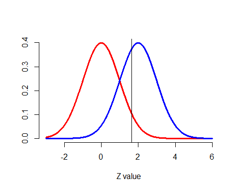<!-- -->

- The red distribution represents H_0 and the blue distribution represents H_a

- The mean proposed by H_a=  $2$ 

- __POWER__ is how much of the blue distribution lies to the right of that big vertical line   
It's the area under the blue curve (H_a) to the right of the vertical line. 


### Back to Sleep Example

- mua = 32, mu0 = 30 , sigma = 4 , n = $16$ , alpha = .05

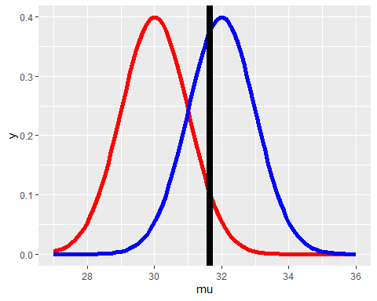<!-- -->

- The red distribution represents H_0 and the blue distribution represents H_a

- The mean proposed by H_a=  $32$

- __POWER__ is how much of the blue distribution lies to the right of that big vertical line   
It's the area under the blue curve (H_a) to the right of the vertical line. 


### POWER in Action
-  Suppose that we wanted to detect a increase in mean RDI
  of at least 2 events / hour (above 30). 
- **Assume normality** and that the sample in question will have a standard deviation of $4$
- What would be the power if we took a sample size of $16$?
  - $Z_{1-\alpha} = 1.645$ 
  - $\frac{\mu_a - 30}{\sigma /\sqrt{n}} = 2 / (4 /\sqrt{16}) = 2$ 
  - $P(Z > 1.645 - 2) = P(Z > -0.355) = 64\%$

```r
pnorm(-0.355, lower.tail = FALSE)
```

```
## [1] 0.6387052
```

```r
z <- qnorm(.95)
pnorm(30+z,mean=32,lower.tail=FALSE)
```

```
## [1] 0.63876
```

- To see power in action, try this manipulate code on R


```r
library(manipulate) 
mu0 = 30 
myplot <- function(sigma, mua, n, alpha){
    g = ggplot(data.frame(mu = c(27, 36)), aes(x = mu))
    g = g + stat_function(fun=dnorm, geom ="line",args = list(mean = mu0, sd = sigma / sqrt(n)), size = 2, col = "red") 
    g = g + stat_function(fun =dnorm, geom ="line", args = list(mean = mua, sd = sigma/sqrt(n)), size = 2, col = "blue")
    xitc = mu0 +qnorm(1 - alpha)* 2 *sigma/sqrt(n)
    g = g + geom_vline(xintercept=xitc, size = 3)
    print(g)}

manipulate(
    myplot(sigma, mua, n, alpha),
    sigma =slider(1, 10, step = 1, initial = 4),
    mua = slider(30, 35, step = 1, initial = 32),
    n = slider(1, 50, step = 1, initial = 16),
    alpha = slider(0.01, 0.1, step = 0.01, initial= 0.05) 
  )
```


- We've fixed mu_0 at 30, sigma (standard deviation) at 4 and n (sample size) at 16. The **function myplot** just needs an **alternative mean**, mu_a, as argument. 

- Run myplot now with an argument of 34 to see what it does.

```r
myplot(34)
```

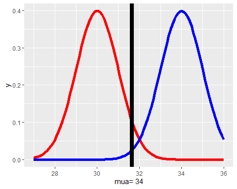<!-- -->

- The distribution represented by H_a **moved to the right**, so almost all (100%) of the blue curve is to the right of the vertical line, indicating that with mu_a=34, the test is more powerful, i.e., there's a higher probability that it's correct to reject the null hypothesis since it appears false. 

- Now try myplot with an argument of 33.3.

```r
  myplot(33.3)
```

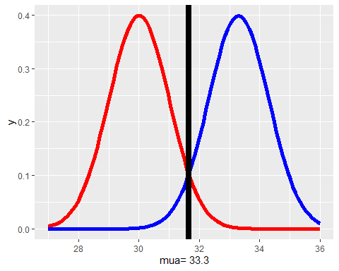<!-- -->


- This isn't as powerful as the test with mu_a=34 but it makes a pretty picture. 

- Now try myplot with an argument of 30.

```r
  myplot(30)
```

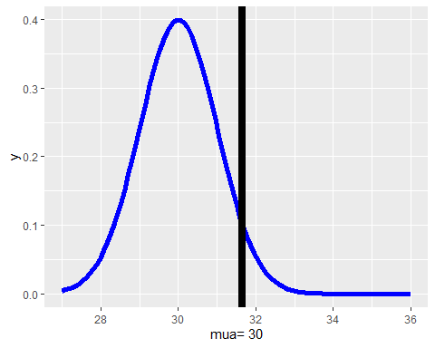<!-- -->

- The power now, the area under the blue curve to the right of the line, is **exactly 5% or alpha**!


- First, power is a function that **depends** on a specific value of an alternative mean, **mu_a**, which is any value *greater than mu_0*, the mean hypothesized by H_0.

- Second, if **mu_a** is much **bigger** than mu_0=30 then the **power** (probability) is **bigger** than if mu_a is close to 30. As mu_a approaches 30, the mean under H_0, the power approaches alpha.

- Just for fun try myplot with an argument of 28.


```r
myplot(28)
```

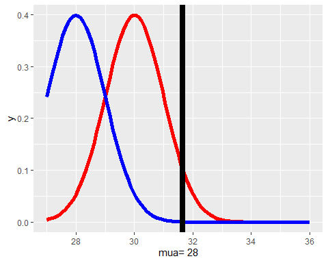<!-- -->

- We see that the blue curve has moved to the left of the red, so the area under it, to the right of the line, is less than the 5% under the red curve. This then is even **less powerful** and contradicts H_a so it's not worth looking at.


- Here's a picture of the power curves for different sample sizes. The alternative means, the mu_a's, are plotted along the horizontal axis and power along the vertical.


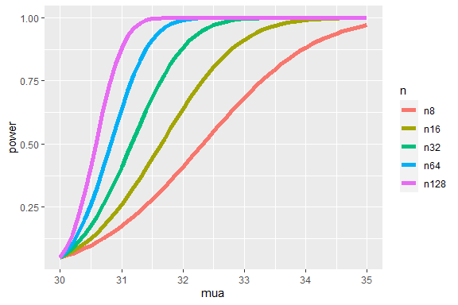<!-- -->

- It shows that as mu_a gets bigger, it gets more powerful
  
- As sample size gets bigger, it gets more powerful


- Let's look at the **portly distributions**.

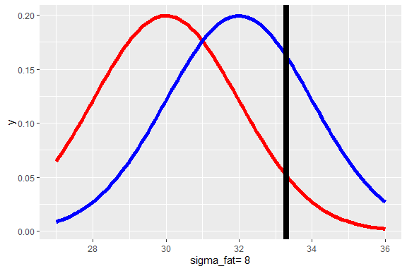<!-- -->


- With this standard deviation=2 (fatter distribution) will power be greater or less than with the standard deviation=1?  
    `less than`
  
- To see this

```r
# sd=1
pnorm(30+z,mean=32,sd=1,lower.tail=FALSE)
```

```
## [1] 0.63876
```

```r
#sd=2
pnorm(30+z*2,mean=32,sd=2,lower.tail=FALSE)
```

```
## [1] 0.259511
```

- As variance increases, what happens to power?

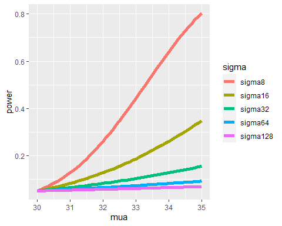<!-- -->


- As alpha increases, what happens to power? 

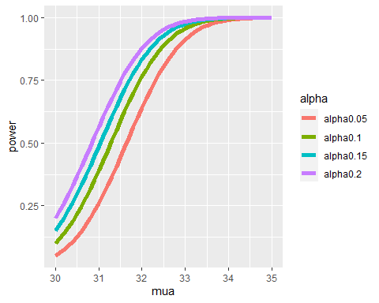<!-- -->


### Equations
- When testing $H_a : \mu > \mu_0$, notice if power is $1 - \beta$, then 
$$1 - \beta = P\left(Z > z_{1-\alpha} - \frac{\mu_a - \mu_0}{\sigma /\sqrt{n}} ~|~ \mu = \mu_a \right) = P(Z > z_{\beta})$$
- This yields the equation
$$z_{1-\alpha} - \frac{\sqrt{n}(\mu_a - \mu_0)}{\sigma} = z_{\beta}$$
- Unknowns: $\mu_a$, $\sigma$, $n$, $\beta$
- Knowns: $\mu_0$, $\alpha$
- Specify any 3 of the unknowns and you can solve for the remainder


### Conclusion
- The calculation for $H_a:\mu < \mu_0$ is similar
- For $H_a: \mu \neq \mu_0$ calculate the one sided power using
  $\alpha / 2$ (this is only approximately right, it excludes the probability of getting a large TS in the opposite direction of the truth)
- Power goes up as $\alpha$ gets larger
- Power of a one sided test is **greater** than the power of the associated two sided test
- Power goes up as $\mu_1$ gets further away from $\mu_0$
- Power goes up as $n$ goes up
- Power doesn't need $\mu_a$, $\sigma$ and $n$, instead only $\frac{\sqrt{n}(\mu_a - \mu_0)}{\sigma}$
  - The quantity $\frac{\mu_a - \mu_0}{\sigma}$ is called the **effect size**, the difference in the means in standard deviation units.
  - Being unit free, it has some hope of interpretability across settings


### T-test power


-  Consider calculating power for a Gossett's $T$ test for our example
-  The power is
  $$
  P\left(\frac{\bar X - \mu_0}{S /\sqrt{n}} > t_{1-\alpha, n-1} ~|~ \mu = \mu_a \right)
  $$
- since the proposed distribution is **not centered at mu_0**, we have to use the **non-central t distribution**. 
- `power.t.test` does this very well
  - Omit one of the arguments and it solves for it


#### Example

- We'll run it three times with the same values for n (16) and alpha (.05) but different delta and standard deviation values.


```r
power.t.test(n = 16, delta = 2 / 4, sd=1, type = "one.sample",  alt = "one.sided")$power
```

```
## [1] 0.6040329
```

```r
power.t.test(n = 16, delta = 2, sd=4, type = "one.sample",  alt = "one.sided")$power
```

```
## [1] 0.6040329
```

```r
power.t.test(n = 16, delta = 100, sd=200, type = "one.sample", alt = "one.sided")$power
```

```
## [1] 0.6040329
```

- So keeping the **effect size** (the ratio delta/sd) constant preserved the power. Let's try a similar experiment except now we'll specify a power we want and solve for the sample size n. 


```r
power.t.test(power = .8, delta = 2 / 4, sd=1, type = "one.sample",  alt = "one.sided")$n
```

```
## [1] 26.13751
```

```r
power.t.test(power = .8, delta = 2, sd=4, type = "one.sample",  alt = "one.sided")$n
```

```
## [1] 26.13751
```

```r
power.t.test(power = .8, delta = 100, sd=200, type = "one.sample", alt = "one.sided")$n
```

```
## [1] 26.13751
```

---

##  Multiple Testing

### Key ideas

* Hypothesis testing/significance analysis is commonly overused
* Correcting for multiple testing avoids false positives or discoveries
* Two key components
  * Error measure
  * Correction


### Types of errors

Suppose you are testing a hypothesis that a parameter $\beta$ equals zero versus the alternative that it does not equal zero. These are the possible outcomes. 

Test                | $\beta=0$   | $\beta\neq0$   |  Hypotheses
--------------------|-------------|----------------|---------
Claim $\beta=0$     |      $U$    |      $T$       |  $m-R$
Claim $\beta\neq 0$ |      $V$    |      $S$       |  $R$
    Claims          |     $m_0$   |      $m-m_0$   |  $m$

__Type I error or false positive ($V$)__ Say that the parameter does not equal zero when it does

__Type II error or false negative ($T$)__ Say that the parameter equals zero when it doesn't 


### Error rates

__False positive rate__ - The rate at which false results ($\beta = 0$) are called significant: $E\left[\frac{V}{m_0}\right]$

__Family wise error rate (FWER)__ - The probability of at least one false positive ${\rm Pr}(V \geq 1)$

__False discovery rate (FDR)__ - The rate at which claims of significance are false $E\left[\frac{V}{R}\right]$

* The false positive rate is closely related to the type I error rate [http://en.wikipedia.org/wiki/False_positive_rate](http://en.wikipedia.org/wiki/False_positive_rate)


### Controlling the false positive rate

If P-values are correctly calculated calling all $P < \alpha$ significant will control the false positive rate at level $\alpha$ on average. 

<redtext>Problem</redtext>: Suppose that you perform 10,000 tests and $\beta = 0$ for all of them. 

Suppose that you call all $P < 0.05$ significant. 

The expected number of false positives is: $10,000 \times 0.05 = 500$  false positives. 

__How do we avoid so many false positives?__


### Controlling family-wise error rate (FWER)


The [Bonferroni correction](http://en.wikipedia.org/wiki/Bonferroni_correction) is the oldest multiple testing correction. 

__Basic idea__: 

* Suppose you do $m$ tests

* You want to control FWER at level $\alpha$ so $Pr(V \geq 1) < \alpha$

* Calculate P-values normally

* Set $\alpha_{fwer} = \alpha/m$

* Call all $P$-values less than $\alpha_{fwer}$ significant

__Pros__: Easy to calculate, conservative
__Cons__: May be very conservative


### Controlling false discovery rate (FDR)

This is the most popular correction when performing _lots_ of tests say in genomics, imaging, astronomy, or other signal-processing disciplines. It is called the Benjamini-Hochberg method (BH)

__Basic idea__: 

* Suppose you do $m$ tests

* You want to control FDR at level $\alpha$ so $E\left[\frac{V}{R}\right]$

* Calculate P-values normally

* Order the P-values from smallest to largest $P_{(1)},...,P_{(m)}$

* Call any $P_{(i)} \leq \alpha \times \frac{i}{m}$ significant


__Pros__: Still pretty easy to calculate, less conservative (maybe much less)

__Cons__: Allows for more false positives, may behave strangely under dependence


- With no correction, how many results are declared significant?  
$4$

- With the Bonferroni correction, how many tests are declared significant?  
  $2$

- Now look at the BH correction. How many tests are significant with this scale?  
  $3$
  
- So the BH correction which limits the FWER is between the No Correction and the Bonferroni. It's more conservative (fewer significant results) than the No Correction but less conservative (more significant results) than the Bonferroni. Note that with this method the threshold is proportional to the ranking of the values so it slopes positively while the other two thresholds are flat.


### Adjusted P-values

* One approach is to adjust the threshold $\alpha$
* A different approach is to calculate "adjusted p-values"
* They _are not p-values_ anymore
* But they can be used directly without adjusting $\alpha$

__Example__: 

* Suppose P-values are $P_1,\ldots,P_m$ 

* You could adjust them by taking $P_i^{fwer} = \max{m \times P_i,1}$ for each P-value. 

* Then if you call all $P_i^{fwer} < \alpha$ significant you will control the FWER. 


### Case study I: no true positives

- To demonstrate some of these concepts, we've created an array of p-values.  
It is 1000-long and the result of a linear regression performed on random normal x,y pairs so there is **no true significant relationship** between the x's and y's.


```r
set.seed(1010093)
pValues <- rep(NA,1000)
for(i in 1:1000){
  y <- rnorm(20)
  x <- rnorm(20)
  pValues[i] <- summary(lm(y ~ x))$coeff[2,4]
}
# Controls false positive rate
sum(pValues < 0.05)
```

```
## [1] 51
```

- So we got around 50 false positives, just as we expected (.05*1000=50).

- Applying corrections of `bonferroni` and `BH`


```r
# Controls FWER 
sum(p.adjust(pValues,method="bonferroni") < 0.05)
```

```
## [1] 0
```

```r
# Controls FDR 
sum(p.adjust(pValues,method="BH") < 0.05)
```

```
## [1] 0
```

- So both corrections eliminated all the false positives that had passed the uncorrected alpha test

## Case study II: 50% true positives

- Now we've generated another 1000-long array of p-values, this one called pValues2. In this data, the first half ( 500 x/y pairs) contains x and y values that are random and the second half contain x and y pairs that are related, so running a linear regression model on the 1000 pairs should find some significant  (not random) relationship.


```r
set.seed(1010093)
pValues <- rep(NA,1000)
for(i in 1:1000){
  x <- rnorm(20)
  # First 500 beta=0, last 500 beta=2
  if(i <= 500){y <- rnorm(20)}else{ y <- rnorm(20,mean=2*x)}
  pValues[i] <- summary(lm(y ~ x))$coeff[2,4]
}
trueStatus <- rep(c("zero","not zero"),each=500)
table(pValues < 0.05, trueStatus)
```

```
##        trueStatus
##         not zero zero
##   FALSE        0  476
##   TRUE       500   24
```

- We see that without any correction all 500 of the truly significant (nonrandom) tests were correctly identified in the \"not zero\" column. In the zero column (the truly random tests), however, 24 results were flagged as significant." 

- The percentage of false positives just as we expected - around 5% or 24/500.

- Let's try our corrections to decrease the error


```r
# Controls FWER 
table(p.adjust(pValues,method="bonferroni") < 0.05,trueStatus)
```

```
##        trueStatus
##         not zero zero
##   FALSE       23  500
##   TRUE       477    0
```

- Since the Bonferroni correction method is more conservative than just comparing p-values to alpha all the truly random tests are correctly identified in the zero column. In other words, we have no false positives. However, the threshold has been adjusted so much that 23 of the truly significant results have been misidentified in the not zero column. 


```r
# Controls FDR 
table(p.adjust(pValues,method="BH") < 0.05,trueStatus)
```

```
##        trueStatus
##         not zero zero
##   FALSE        0  487
##   TRUE       500   13
```

- The results are a compromise between the No Corrections and the Bonferroni. All the significant results were correctly identified in the \"not zero\" column but in the random (\"zero\") column 13 results were incorrectly identified. These are the false positives. This is roughly half the number of errors in the other two runs."


- What about making a plot to see the effect of correction  on P Values:


__P-values versus adjusted P-values__

```r
par(mfrow=c(1,2))
plot(pValues,p.adjust(pValues,method="bonferroni"),pch=19, ylab="bonferroni correction")
plot(pValues,p.adjust(pValues,method="BH"),pch=19, ylab="BH correction")
```

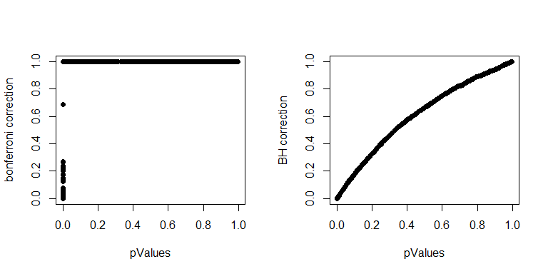<!-- -->

### Conclusion
* Multiple testing is an entire subfield
* A basic Bonferroni/BH correction is usually enough
* If there is strong dependence between tests there may be problems
  * Consider method="BY"


---

## Resampling


### The bootstrap
- The bootstrap is a tremendously useful tool for constructing confidence intervals and calculating standard errors for difficult statistics

- For example, how would one derive a confidence interval for the median?

- The bootstrap procedure follows from the so called bootstrap principle


### The bootstrap principle
- Suppose that I have a statistic that estimates some population parameter, but I don't know its sampling distribution

- The bootstrap principle suggests using the distribution defined by the data to approximate its sampling distribution

- In practice, the bootstrap principle is always carried out using simulation

- We will cover only a few aspects of bootstrap resampling

- The general procedure follows by first simulating complete data sets from the observed data with replacement

- This is approximately drawing from the sampling distribution of that statistic, at least as far as the data is able to approximate the true population distribution

- Calculate the statistic for each simulated data set

- Use the simulated statistics to either define a confidence interval or take the standard deviation to calculate a standard error

### Nonparametric bootstrap algorithm example
- Bootstrap procedure for calculating confidence interval for the median from a data set of $n$ observations
  i. Sample $n$ observations **with replacement** from the observed data resulting in one simulated complete data set
  
  ii. Take the median of the simulated data set
  
  iii. Repeat these two steps $B$ times, resulting in $B$ simulated medians
  
  iv. These medians are approximately drawn from the sampling distribution of the median of $n$ observations; therefore we can
  
    - Draw a histogram of them
    - Calculate their standard deviation to estimate the standard error of the median
    - Take the $2.5^{th}$ and $97.5^{th}$ percentiles as a confidence interval for the median


### Example code


```r
library(UsingR)
data(father.son)
x <- father.son$sheight
n <- length(x)
B <- 1000
resamples <- matrix(sample(x,
                           n * B,
                           replace = TRUE),
                    B, n)
medians <- apply(resamples, 1, median)
sd(medians)
```

```
## [1] 0.08458934
```

```r
quantile(medians, c(.025, .975))
```

```
##     2.5%    97.5% 
## 68.43816 68.81461
```


### Histogram of bootstrap resamples


```r
hist(medians)
```

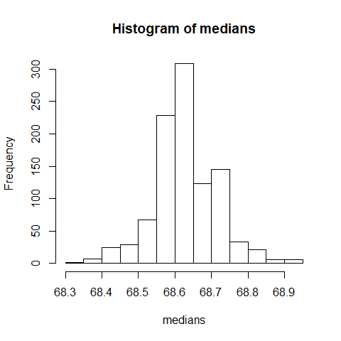<!-- -->


### Notes on the bootstrap

- The bootstrap is non-parametric

- Better percentile bootstrap confidence intervals correct for bias

- There are lots of variations on bootstrap procedures; the book "An Introduction to the Bootstrap"" by Efron and Tibshirani is a great place to start for both bootstrap and jackknife information


### Group comparisons
- Consider comparing two independent groups.

- Example, comparing sprays B and C


```r
data(InsectSprays)
boxplot(count ~ spray, data = InsectSprays)
```

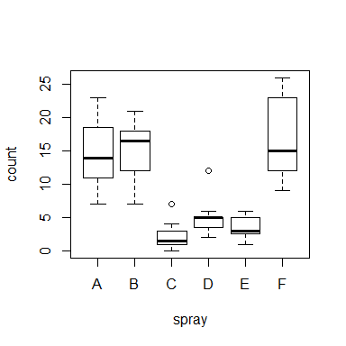<!-- -->


### Permutation tests

-  Consider the null hypothesis that the distribution of the observations from each group is the same

-  Then, the group labels are irrelevant

-  We then discard the group levels and permute the combined data

-  Split the permuted data into two groups with $n_A$ and $n_B$
  observations (say by always treating the first $n_A$ observations as
  the first group)

-  Evaluate the probability of getting a statistic as large or
  large than the one observed

-  An example statistic would be the difference in the averages between the two groups;
  one could also use a t-statistic 

### Variations on permutation testing
Data type | Statistic | Test name 
---|---|---|
Ranks | rank sum | rank sum test
Binary | hypergeometric prob | Fisher's exact test
Raw data | | ordinary permutation test

- Also, so-called *randomization tests* are exactly permutation tests, with a different motivation.

- For matched data, one can randomize the signs
  - For ranks, this results in the signed rank test

- Permutation strategies work for regression as well
  - Permuting a regressor of interest

- Permutation tests work very well in multivariate settings


### Permutation test for pesticide data

```r
subdata <- InsectSprays[InsectSprays$spray %in% c("B", "C"),]
y <- subdata$count
group <- as.character(subdata$spray)
testStat <- function(w, g) mean(w[g == "B"]) - mean(w[g == "C"])
observedStat <- testStat(y, group)
permutations <- sapply(1 : 10000, function(i) testStat(y, sample(group)))
observedStat
```

```
## [1] 13.25
```

```r
mean(permutations > observedStat)
```

```
## [1] 0
```


- So on average 0 of the permutations had a difference greater than the observed. That means we would reject the null hypothesis that the means of the two sprays were equal.


### Histogram of permutations
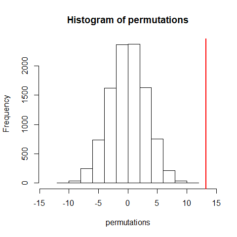<!-- -->

- We can see that the distribution runs roughly between -10 and +10 and it's centered around 0. The vertical line shows where the observed difference of means was and we see that it's pretty far away from the distribution of the resampled permutations. This means that group identification did matter and sprays B and C were quite different.
